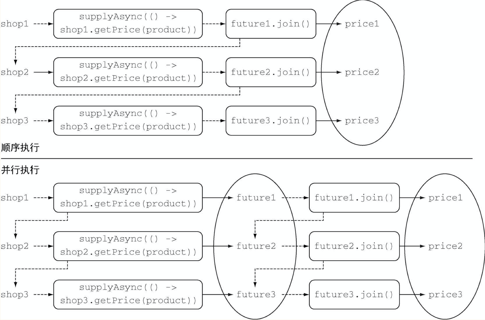

# 第 16 章 CompletableFuture：组合式异步编程

## 16.1 Future 接口

- 一大优点：比底层的 Thread 更好用

### 16.1.1 Future 接口的局限性

当长时间计算任务完成时，将该计算的结果通知到另一个长时间运行的计算任务，这两个计算任务都完成后，将计算的结果与另一个查询操作结果合并。

### 16.1.2 使用 CompletableFuture 构建异步应用

## 16.2 实现异步 API

### 16.2.1 将同步方法转换为异步方法

### 16.2.2 错误处理

工厂方法 CompletableFuture.supplyAsync

## 16.3 让你的代码免受阻塞之苦

### 16.3.2 使用 CompletableFuture 发起异步请求

代码清单 16-11 

```java
public List<String> findPrices(String product) {
    List<CompletableFuture<String>> priceFutures =
            shops.stream()
                    // 使用 CompletableFuture 以异步方式及时每种商品的价格
            .map(shop -> CompletableFuture.supplyAsync(
                    () -> shop.getName() + " price is" + shop.getPrice(product)
            ))
            .collect(Collectors.toList());
    return priceFutures.stream()
            // 等待所有异步操作结束
            .map(CompletableFuture::join)
            .collect(Collectors.toList());
}
```

 使用两个不同的 Stream 流水线，而不是在同一个处理流的流水线上一个接一个地放置两个 map 操作，是因为：

 - 在单一流水线中处理流，发向不同商家的请求只能以同步、顺序执行
 - 因此，每个创建 CompletableFuture 对象只能在前一个操作结束之后执行查询指定商家的动作，通知 join 方法返回计算结果
 - 图 16-2 解释了这些重要的细节

