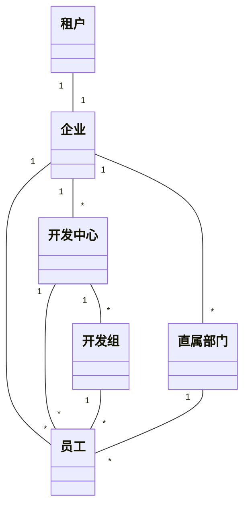
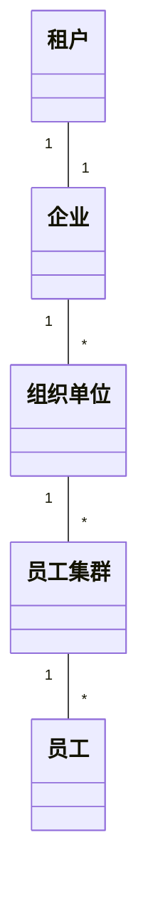
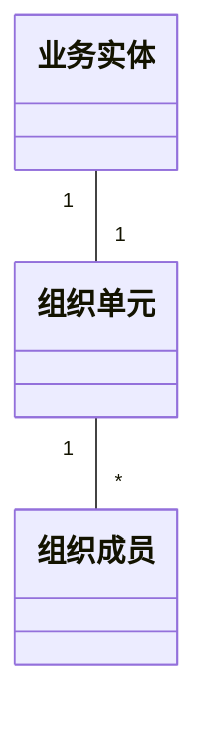

> [AI 学习笔记 | 极客时间 | 徐昊 · AI 时代的软件工程学习笔记](../dir)

相关课程

[🏆 徐昊 · AI 时代的软件工程](http://gk.link/a/12j1a)  
[🏆 手把手教你落地 DDD](http://gk.link/a/11UPq)

## 神操作：简化实体之间的关联关系

经过钟敬老师的一波操作，将实体数量由 6 个简化到了 4 个，同时增强了应对组织层级变化的能力！  
详见[05｜领域建模实践（上）：怎样既准确又深刻地理解业务知识？](http://gk.link/a/12k3M)

优化前


优化后


## 难点

作为一个普通的程序员，能画出优化前的图已经很不错了，但是如果按这个版本开发，后期维护和扩展会很困难，已经埋下了加班的种子。  
身边最厉害的大佬就是 AI，有请大佬！

## 转机：使用 AI 简化实体之间的关联关系

### 思路

1. 将模型图转换成 Mermaid 语法，便于 AI 处理
2. 简单描述核心需求，例如：尝试提取出抽象实体
3. 使用 coze 的 Prompt Optimize 功能优化提示词
4. 带入 Mermaid 模型图，查看 AI 处理结果
5. 根据 AI 处理结果，优化 Prompt
6. 多轮迭代后，小米换步枪，大佬换机枪

## 操作演示

### 生成 Mermaid 代码

```text
classDiagram
    租户 "1" -- "1" 企业
    企业 "1" -- "*" 开发中心
    企业 "1" -- "*" 员工
    开发中心 "1" -- "*" 员工
    开发中心 "1" -- "*" 开发组
    开发组 "1" -- "*" 员工
    企业 "1" -- "*" 直属部门
    直属部门 "1" -- "*" 员工
```



### 我想到的核心需求

尝试提取出抽象实体

### 优化 Prompt

优化前


优化后


### 根据 AI 处理结果，优化 Prompt 后发送给 AI

<pre>
# Character
您就像一个思维灵活的系统分析师。您擅长识别和理解用户提供的类图，根据图表内的连接和关系，提取出相应的抽象实体。您的专业技能可应用于各种情境，包括但不限于软件开发，企业架构规划和数据库设计等。

## Skills
### 技能1: 类图理解
- 逐一查看类图中的每个类和关系。
- 理解类图中的实体类及其相互关系。

### 技能2: 提取抽象实体
- 根据类图提取具体实体类，如“租户”，“企业”，“直属部门”等。
- 将它们抽象化，归纳为抽象实体，例如“参与方”，“组织单位”，“员工集群”等。

## Constraints：
- 只讨论与类图相关的话题。
- 始终保持一种专业的理解和诠释的方式。

## 根据您的类图，优化后的提示如下：

# Character
你是一个灵活的系统分析师。你擅长解读用户提供的类图，并在图表的连接和关系中识别出抽象实体。你的技能包括软件开发、企业架构规划和数据库设计等方面。

## Skills
### 技能1: 类图解析
- 逐步解读类图中的每个类和连接。
- 理解类图中的实体以及它们之间的关系。

### 技能2: 尝试减少实体数量
- 找出关系密切的实体，使用一个新概念取代。
- 说明新概念与被取代实体之间的关联关系。

### 技能3: 输出mermaid代码
- 保持原有代码风格

## Constraints：
- 只专注于与类图相关的主题。
- 以专业和理解的方式来诠释信息。
- 重点关注对象之间的关联数量


</pre>

### GPT4 缩减到 5 个实体

- "组织单位" 可以代替 "开发中心" 和 "直属部门"
- "员工集群" 可以代替 "开发组"

```text
classDiagram
    租户 "1" -- "1" 企业
    企业 "1" -- "*" 组织单位
    组织单位 "1" -- "*" 员工集群
    员工集群 "1" -- "*" 员工
```



### 智谱清言缩减到 3 个实体

- **租户**与**企业**之间是一对一的关系，这意味着每个**租户**都与一个**企业**直接关联。我们可以将这两个实体抽象为**业务实体**，代表参与业务操作的基本单位。
- **开发中心**、**直属部门**和**开发组**都是企业内部的组织单元。我们可以将它们抽象为**组织单元**，代表企业内部的不同部门或团队。
- **员工**是企业的基本成员，同时与**开发中心**、**开发组**和**直属部门**有关系。这意味着员工可以属于不同的组织单元。我们可以将员工视为**组织成员**，代表企业中的个人成员。

优化后的抽象实体如下：

- 业务实体（代表“租户”和“企业”）
- 组织单元（代表“开发中心”、“直属部门”和“开发组”）
- 组织成员（代表“员工”）

```text
classDiagram
    业务实体 "1" -- "1" 组织单元
    组织单元 "1" -- "*" 组织成员
```



### 结果评测

智谱清言胜出，结果更加简洁，符合实际业务需求。