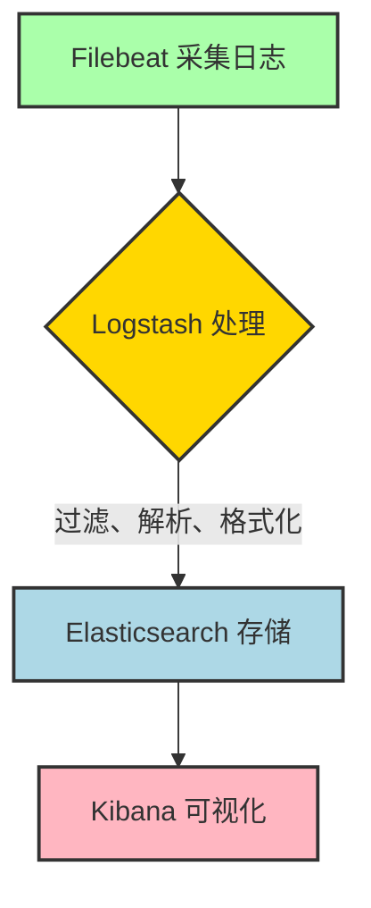
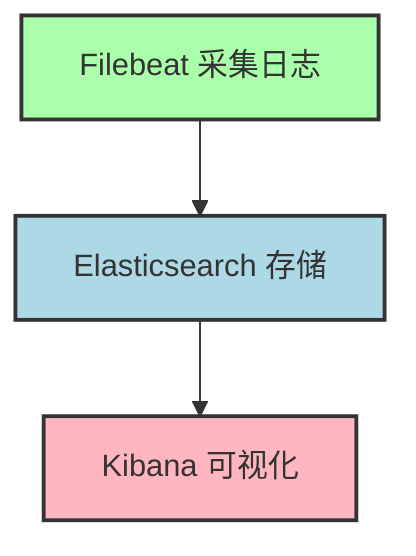

[ELK/Elastic Stack](../dir)

## 采集流程

Filebeat 采集日志 -> Logstash 处理「过滤、解析、格式化」 -> Elasticsearch 存储 -> Kibana 可视化
Filebeat 采集日志 -> Elasticsearch 存储 -> Kibana 可视化





## [Beats 轻量型数据采集器](https://www.elastic.co/cn/beats/)

## [Filebeat 轻量型日志采集器](https://www.elastic.co/cn/beats/filebeat)

[Filebeat 文档](https://www.elastic.co/docs/reference/beats/filebeat)

## [Elasticsearch](https://www.elastic.co/elasticsearch)

### [本地集群部署](https://www.elastic.co/docs/deploy-manage/deploy/self-managed)

### 常用命令

启动

```bash
# 前台启动（控制台会显示日志，Ctrl+C 停止）
./bin/elasticsearch

# 后台启动（使用 -d 参数，日志输出到 logs/ 目录）
./bin/elasticsearch -d -p pid
```

参数说明

- -d：后台运行（daemonize）。
- -p pid：将进程 ID 写入指定文件（如 pid），用于后续停止服务。

停止

```bash
# 方式1：通过进程ID停止（适用于后台启动）
kill $(cat pid)

# 方式2：通过系统服务停止（如果已注册为系统服务）
sudo systemctl stop elasticsearch

# 方式3：强制终止（不推荐，可能导致数据丢失）
pkill -f elasticsearch
```

检查集群健康状态

```bash
curl -X GET "localhost:9200/_cluster/health?pretty"

# Elasticsearch 9.0 默认启用安全功能，需使用用户名和密码访问 API
curl -u "elastic:your_password" -X GET "localhost:9200/_cluster/health?pretty"
curl -u "elastic:Yj-2q-Ae7wo1t--h=W85" -X GET "localhost:9200/_cluster/health?pretty"
```

返回示例

```json
{
  "cluster_name" : "elasticsearch",
  "status" : "green",  # green=健康，yellow=部分副本未分配，red=有数据丢失
  "timed_out" : false,
  "number_of_nodes" : 1,
  "number_of_data_nodes" : 1,
  ...
}
```

查看节点信息

```bash
curl -X GET "localhost:9200/_nodes?pretty"
```

重置内置 kibana_system 用户的密码

```bash
# 密码 kk1123
./bin/elasticsearch-reset-password -u kibana_system -i
```

参数说明

- -u kibana_system：指定要重置密码的用户名为 kibana_system。
- -i：交互式输入密码（会提示你输入并确认新密码）。


## [Kibana](https://www.elastic.co/kibana)

### 常用命令

启动

```bash
# 前台启动（控制台会显示日志，Ctrl+C 停止）
./bin/kibana

# 后台启动（使用 & 符号，日志输出到 logs/ 目录）
./bin/kibana &
```

停止

```bash
# 通过进程ID停止
pkill -f kibana

# 或使用系统服务（如果已注册为系统服务）
sudo systemctl stop kibana
```

检查 Kibana 状态

```bash
curl -u "elastic:your_password" "localhost:5601/api/status"
curl -u "elastic:Yj-2q-Ae7wo1t--h=W85" "localhost:5601/api/status"
```

## 补充

filebeat
收集日志
日志格式化:JSON、正则

ES
按不同字段存储:IP、日志级别、时间、日志内容
对关键字段建立索引，提升查询效率
注意:在索引字段中尽量不要保存无意义的日志，因为大量垃圾数据会拖慢查询效率，例如保存所有的查询SQL语句

高可用
ES 集群
ES 索引主备
Filebeat + Logstash 限流

其他
需要评估 filebeat 占用内存、网络等资源对同服务器其他应用程序的影响
ES索引需设置最大存储容量、定时清理策略，避免撑爆磁盘
需要验证当ES不可用、filebeat正常采集日志时，是否会影响到其采集的应用程序

扩展
可以对一个时间段内采集到的错误日志数量进行统计，设定告警阈值，监测到异常情况后及时通知相关同事，避免事故升级